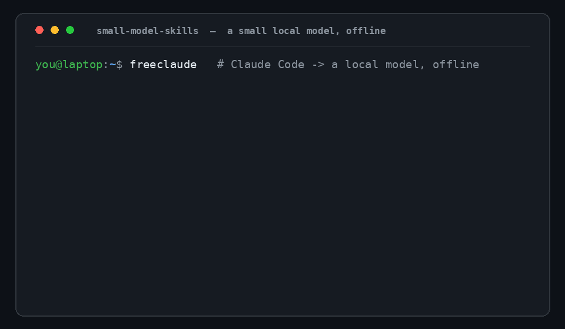

# small-model-skills

[](https://www.repostatus.org/#wip)
[](LICENSE)

**Claude Code Agent Skills + shell tools built for _small local models_ — the ones you run when you
can't (or won't) run a frontier or 70B model.** Diagnostics and offline-dev help for a Linux
workstation, driven by a ~7–30B model on a consumer GPU or CPU, fully offline.



<sub>Real capture, one offline session: a small local model (`qwen3-coder-cc`) answers two questions — first reading the SonicWall's WAN links + failover over SNMP + REST (`router-status`), then finding why the box is slow (`sys-diag`). The wrapper tables/verdicts and the model's replies are all verbatim. Rendered with `python3 media/build-demo.py` (Pillow, no screen recording).</sub>

## Why this exists

Most Agent Skills and agentic tooling quietly assume a frontier model (Claude/GPT-class), or at least a
70B on a big GPU. The moment you can't run that — a modest GPU, CPU-only, offline/air-gapped, or
privacy/cost limits — that tooling degrades badly: context overflows, the model can't follow the
instructions, and it can't make the tool calls reliably.

This library goes the other way: skills authored **from the constraint down**, so a small local model
can do genuinely useful work. Every skill follows one rule — **the scripts do the work; the model just
orchestrates and explains** — and everything is read-only by default, proposing fixes for a human to run.
It competes with **your ad-hoc prompts and glue scripts**, not with your inference stack.

## Who it's for

You drive a **local model, offline**, and want it to do reliable local ops. That's the through-line —
model *size* is secondary:

- A consumer GPU with **limited VRAM** — 8–16 GB, where a 70B simply won't fit — or CPU-only. The rest of
  the box can be powerful; **VRAM is the ceiling.** (Models via Ollama / llama.cpp.)
- Offline or air-gapped — a plane, an ISP outage, a locked-down network.
- Privacy, cost, or data-residency rules out hosted frontier APIs.

Small models are the **design floor** — the hardest case, and what everything here is hardened for. A
larger local model (say a 70B, offline) benefits from the exact same things — deterministic wrappers that
own the *how*, your local facts baked into config, read-only safety — it just has more headroom.

**Is this for you? (30-second test):** yes, if you're driving a **local** model and need it useful
**without a network**. If you have a capable model *and* an internet connection, a general agent that can
browse and improvise will do more.

## Platform support

Built and tested on **Linux** today. **macOS** (native) and **Windows** (via WSL2, not a native
PowerShell port) support is in active design — see
[`docs/superpowers/specs/2026-07-06-cross-platform-axi-design.md`](docs/superpowers/specs/2026-07-06-cross-platform-axi-design.md)
and [`DESIGN.md`](DESIGN.md#platform-support--axi-conventions-in-design) for the plan. Not implemented yet;
`install.sh` on macOS today will hit missing/incompatible commands in some wrappers (`system-triage`,
`log-triage` in particular — they lean on `systemd`/`journald`, which macOS doesn't have).

## What it's NOT (and honest limits)

- **Not a substitute for a general agent framework — when you have a capable model _and_ a network.** Then
  browsing + improvising win. These skills earn their keep **offline/local**, where even a big model lacks
  your local facts and the web. (Model *size* isn't the line; the network + a capable model is.)
- **Not a model runner.** It doesn't serve, quantize, or host models — bring your own via Ollama (see
  [Setup](#setup)).
- **Not magic.** Skills raise the ceiling on what a small model does *reliably*; they don't make a 7B
  equal a 70B. Think limp-home mode — real value offline or constrained, not a daily driver for big work.
- **Auto-triggering is unreliable at this size.** A ~7–30B model often won't pick the right skill from a
  vague prompt on its own — so **name the skill** ("use system-triage…") or **run the wrapper directly**
  (`sys-diag`). Both always work.

## What's included

**Diagnostics** (read-only triage; each is a wrapper script + a short SKILL.md runbook):
| Skill | Answers |
|---|---|
| `network-triage` | internet down? ISP vs DNS vs LAN vs failover (SNMP + optional router module) |
| `system-triage` | why is my computer slow? (CPU / load / memory / top hogs / thermal) |
| `disk-report` | why is my disk full? (biggest dirs/files, caches, docker, logs) |
| `log-triage` | what service is broken / what's erroring? (failed units, recent errors) |

**Offline-dev** (the plane case):
| Skill | Does |
|---|---|
| `offline-dev` | `offline-prep` (pre-cache deps/images/model *before* you lose signal) + `offline-doctor` (diagnose why a build/run fails offline) |

**For contributors:** `audit-small-model-skills` + `skill-audit` enforce the authoring standard
(`docs/authoring-small-model-skills.md`) so new skills stay small-model-safe.

## Quickstart (~2 min)

The tools are deterministic and work **standalone** — no model, no config, no network needed — so you can
prove they run on *your* box before wiring up a model:

```bash
git clone <this-repo> && cd small-model-skills && ./install.sh
sys-diag        # read-only "why is it slow?" snapshot
```
```text
===== sys-diag  2026-07-06 09:14:02 =====
-- load / cpu --
  load(1m) vs cores      6.2 / 8
-- memory --
  Mem:    16Gi   used 14Gi   free 0.4Gi   available 1.1Gi
  Swap:    8Gi   used  5Gi   free  3Gi
-- top CPU processes --
  4821     ollama          cpu=712%  mem=41%
-- verdict --
  HIGH LOAD: 1-min load (6.2) well above core count (8) -> something is saturating the CPU.
```

Then point a small local model at the skills (see [Setup](#setup)) and ask in plain English — the model
runs the read-only tool and explains, proposing (never executing) any fix:

```text
$ claude-local
> why is my computer slow?

  Your computer is slow because a local LLM process is maxing several CPU cores (~712%) and RAM is
  nearly exhausted (0.4 GiB free, swapping). Load average 6.2 on 8 cores.
  Proposed (not run): stop the runaway process, or use a smaller model.
```

## Setup

### 1. A local model in Ollama
Install [Ollama](https://ollama.com), then pull a **tool-capable** coder model:
```bash
ollama pull qwen2.5-coder:14b     # fits a 12 GB GPU; fast
# or qwen3-coder / a Qwable GGUF (needs Ollama >= 0.24 for the qwen3.6 arch)
```
Raise the served context (Ollama defaults to ~4K, too small for an agent) via a Modelfile:
```
FROM qwen2.5-coder:14b
PARAMETER num_ctx 32768
```
```bash
ollama create qwen2.5-coder-cc -f Modelfile
```
For an **agent-purpose** engine, see [`models/agents-a1/`](models/agents-a1/) — Agents-A1 (35B MoE, 3B
active) is built for tool-loops; its GGUF needs a one-line template fix that `install-model.sh` applies.

### 2. Point Claude Code at it offline
Ollama ≥ 0.14 speaks Anthropic's API natively, so no proxy is needed. Add a launcher to your shell rc:
```bash
claude-local() {                       # run Claude Code against the local model
  local model="${CLAUDE_LOCAL_MODEL:-qwen2.5-coder-cc}"
  ANTHROPIC_BASE_URL="http://localhost:11434" ANTHROPIC_AUTH_TOKEN="ollama" ANTHROPIC_API_KEY="" \
  ANTHROPIC_MODEL="$model" ANTHROPIC_SMALL_FAST_MODEL="$model" \
  CLAUDE_CODE_DISABLE_NONESSENTIAL_TRAFFIC=1 command claude "$@"
}
```
Your normal `claude` is untouched; `claude-local` uses the offline model.

### 3. Install the skills
```bash
git clone <this-repo> && cd small-model-skills
./install.sh            # copies skills -> ~/.claude/skills, links wrappers, seeds a config
```
Override the wrapper location with `SMS_BINDIR=~/bin ./install.sh` if `~/.local/bin` isn't on your PATH.

### 4. Configure for your machine
Edit `~/.config/small-model-skills/config` (created by the installer) — gateway IP, DNS, WAN interface
names, and your router (see `config.example`). Blank values auto-detect where possible. Nothing
host-specific lives in the repo; it all lives here.

### 5. Use it
```bash
claude-local
> why is my computer slow?
> the internet is flaky, what's wrong?
> prep this project for offline work
```
The model loads the matching skill, runs the read-only wrapper, and explains the result — proposing any
fix for you to run. (It runs with normal permission prompts; it won't change anything on its own.)

## Routers
`network-triage` reads live WAN status over generic SNMP (any SNMP router — just set `WAN_PRIMARY`/
`WAN_BACKUP`/`SNMP_COMMUNITY`). A **module** adds vendor detail; a SonicWall (SonicOS 7) reference module
ships in `modules/router/`. To add yours, see `modules/router/interface.md`.

## Documentation

- [Quickstart](#quickstart-2-min) / [Setup](#setup) — get it running *(start here)*
- [`docs/authoring-small-model-skills.md`](docs/authoring-small-model-skills.md) — the standard for writing
  skills a small model can execute *(how-to + reference)*
- [`DESIGN.md`](DESIGN.md) — architecture and why it's built this way *(explanation)*
- [`docs/superpowers/specs/2026-07-06-cross-platform-axi-design.md`](docs/superpowers/specs/2026-07-06-cross-platform-axi-design.md)
  — planned macOS/Windows(WSL2) support + [AXI](https://axi.md/) output conventions *(design, not yet
  implemented)*
- [`models/README.md`](models/README.md) — getting a local model working with Claude Code, incl. the Ollama
  template gotcha *(reference)*
- [`modules/router/interface.md`](modules/router/interface.md) — add a router/firewall vendor *(reference)*
- [`CONTRIBUTING.md`](CONTRIBUTING.md) · [`CHANGELOG.md`](CHANGELOG.md) · [`SECURITY.md`](SECURITY.md)

*(GitHub renders a section outline from the headings above — no manual table of contents needed.)*

## Contributing

Read [`docs/authoring-small-model-skills.md`](docs/authoring-small-model-skills.md) first — the standard for
writing skills a small model can actually execute (flat steps, read-only, scripts-do-the-work, tiny
context). Then see [`CONTRIBUTING.md`](CONTRIBUTING.md). Every new skill must be tested **on the actual
small model**, not just a frontier one.

## Acknowledgments
Output-format conventions for `bin/` wrappers (identity header, TOON, structured help hints, exit
codes) are being adopted from **[AXI — Agent eXperience Interface](https://axi.md/)**, created by
**[Kun Chen](https://x.com/kunchenguid)** ([github.com/kunchenguid](https://github.com/kunchenguid)).
Credit to him for the standard.

## License
MIT — see `LICENSE`.
